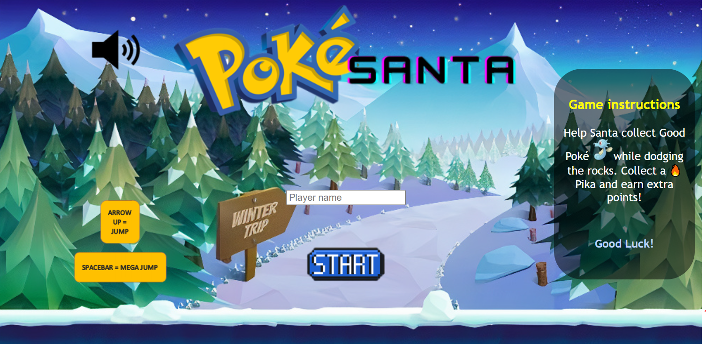
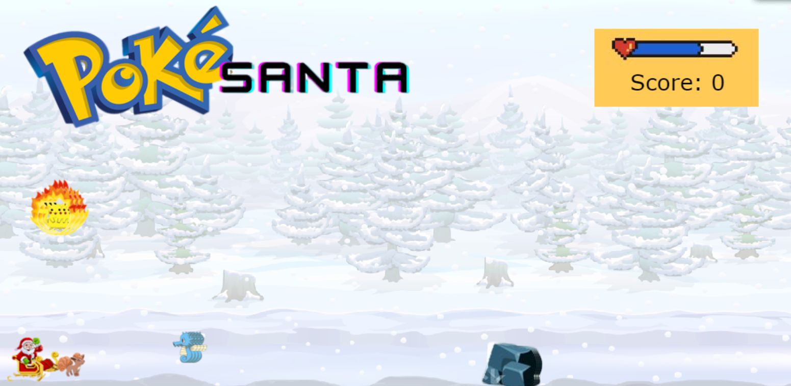
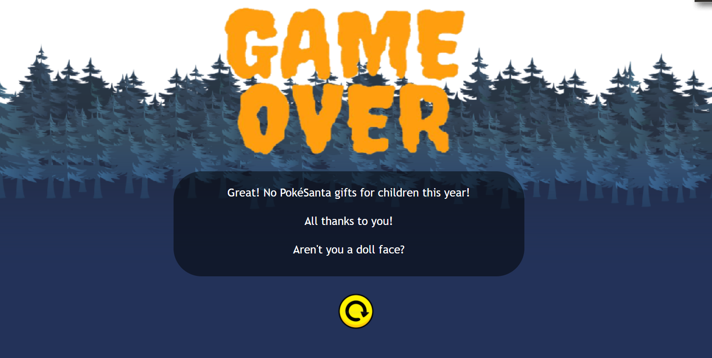
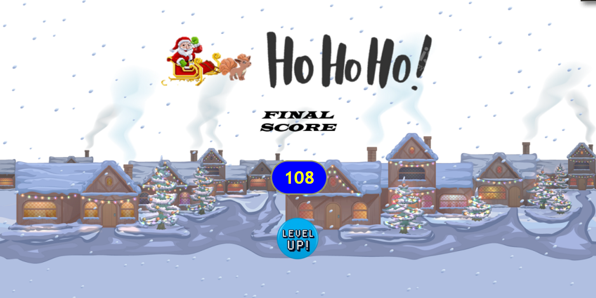

# its-game-time-baby
PokéSanta - collect the good, destroy the bad! 

# PokéSanta
[Link Deploy](https://github.com/codebymymood/its-game-time-baby.git)

## Description
PokéSanta (patent pending, don't rush it!) it's a game where Santa and its pokédeer go around the snowy mountains to collect good pokemons, dodge assassin rocks and save Christmas, by offering good Pokémons to all the children!

## Screenshots
   

## MVP
. game has a character that moves vertically
. rocks are obstacles and will end game
. collect good pokemons to increase score
. pikatchu collect increases score by 10 points
. increase dificulty

## Backlog
. sound on / off - check
. input button for player name - check
. Santa starting in platform - future version
. level up button - check

## Data structure

#style.css

#index.html

#main.js
- window.onload()
    - addEventListener:
        - start button;
        - reset button;
        - event key: keyUp & keyDown;

- obstacles []
- beginGame()
- gameScreen():
    . canvas movement
    . character movement
    . collision
    . score increase
- showGameOver()
- showWin()

## States y States Transitions
Definition of the different states and their transition (transition functions) - how to change screens, DOM

- splashScreen - shows input for players to log their name, explains key use, description of the game & start game button
- gameScreen - Santa in a sleight that moves vertically, dodges rocks and collects good pokemons and pikachus
- gameoverScreen - shows sarcastic motivational quote and restart button
- winScreen - shows final score and level up button (not working in this version)

## Task

. create html & css files
. load all images

#main
. build DOM
. build splashscreen
. event listeners
. build gamescreen
. build gameoverscreen

## Additional Links

### Trello
[Link url](https://trello.com/b/ha01vZyK/pok%C3%A9santa)

### Slides
[Link Slides.com](https://1drv.ms/p/s!AsXsOMZ6ab3llU_uPxsc-zJ2MoC_?e=N5KeA9)
